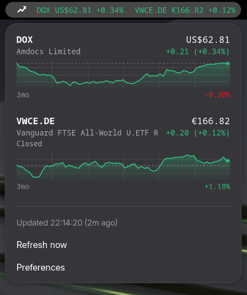

# TopRates

Live stock, ETF, index, currency and crypto quotes from Yahoo Finance in the
GNOME top bar. Any number of symbols can be shown side by side in the panel,
separated by a character of your choice; the popup lists every symbol you
follow with its price, daily change and a price history sparkline, and clicking
a row opens a details window inside the shell — chart, key statistics, trailing
returns and the historical bars, without leaving the desktop for a browser.

Give a symbol a quantity and it becomes a position: the popup then values it,
adds the lot up in a currency of your choosing, and says what it made today.



*The panel indicator and the popup it opens: two followed symbols, each with its
daily change and a sparkline of the selected history period.*

- **UUID:** `toprates@dimitrmo.github.io`
- **Supported shells:** GNOME 48, 49 and 50 (ESM extension API)
- **Session modes:** `user` (not active on the lock screen)
- **Data source:** `query1.finance.yahoo.com/v8/finance/chart/<symbol>` — public,
  no API key, no account

## Requirements

- GNOME Shell 48 or newer
- `glib-compile-schemas` (`glib2-devel` on Fedora, `libglib2.0-dev-bin` on
  Debian/Ubuntu)
- `make` and the `gnome-extensions` CLI (the latter ships with GNOME Shell)
- Working internet access; libsoup 3 is used for the requests

## Install

```bash
make install     # copies into ~/.local/share/gnome-shell/extensions and compiles the schema
```

`./install.sh` does the same thing if you would rather not use make.

Nothing here needs extensions.gnome.org. A GNOME extension is just a directory
under `~/.local/share/gnome-shell/extensions/<uuid>/`, so a local install is a
copy plus a compiled schema. To install on a machine that does not have this
checkout, build the zip here and hand that over:

```bash
make pack                                                   # builds the zip
gnome-extensions install --force toprates@dimitrmo.github.io.shell-extension.zip
```

extensions.gnome.org is only needed to publish — it buys a public listing, the
one-click browser install and update notifications, at the cost of review. It
is not a prerequisite for running the extension.

### Makefile targets

| Target | What it does |
| --- | --- |
| `make` / `make schemas` | Compile the gschema in-tree (a quick schema syntax check) |
| `make translations` | Compile `po/*.po` into `locale/` |
| `make pot` / `make update-po` | Re-extract strings, then merge them into the translations |
| `make install` | Install into `~/.local/share/gnome-shell/extensions/toprates@dimitrmo.github.io` |
| `make reinstall` | Uninstall, then install |
| `make uninstall` | Remove the installed copy |
| `make enable` / `make disable` | Enable or disable in the current session |
| `make prefs` | Open the preferences window |
| `make run` | Install, then launch a nested GNOME Shell to test in |
| `make pack` | Build `toprates@dimitrmo.github.io.shell-extension.zip` (GNOME 48-50) |
| `make test` | Run the validation suite (the checks CI runs) |
| `make unit` | Run just the `finance.js` unit tests |
| `make lint` | Run ESLint over the GJS sources (needs `npm install` first) |
| `make logs` | Follow the shell-side log |
| `make clean` | Remove build artefacts |

## Load the new code

GNOME Shell only picks up newly installed or changed extension code when the
shell process reloads:

- **Wayland:** log out and log back in — or skip that entirely and use
  `make run`, which starts a nested shell.
- **X11:** `Alt`+`F2`, type `r`, `Enter`.

## Enable

```bash
make enable
# or
gnome-extensions enable toprates@dimitrmo.github.io
```

Check state with `gnome-extensions info toprates@dimitrmo.github.io`; `ACTIVE`
means it loaded, `ERROR` means the stack trace is in the shell log.

## Run it without logging out

```bash
make run
```

This installs and then starts a second GNOME Shell in a window
(`gnome-shell --devkit` on GNOME 50, `--nested --wayland` on older versions).
It has its own session bus but shares your dconf, so settings changes are live
in both. Enable the extension inside it:

```bash
DBUS_SESSION_BUS_ADDRESS=<nested bus> gnome-extensions enable toprates@dimitrmo.github.io
```

Close the window to end the nested session.

## Configuring symbols

Open the preferences window — from the popup menu's **Preferences** item, via
`make prefs`, or with `gnome-extensions prefs toprates@dimitrmo.github.io`.

The **Symbols** group is a full editor:

- **Search for a symbol** looks tickers up on Yahoo as you type — "vanguard
  all world" finds `VWRL.SW` and friends — and adding one from the results
  needs no knowledge of the exchange suffix. Duplicates are ignored. The
  lookup uses the same key-free endpoint the extension polls for quotes.
- **+** in the group header appends a blank row to type into directly.
- Type a ticker and press **Enter** (or click the apply button) to save it.
  Entries are upper-cased and blank rows are dropped on save.
- **↑ / ↓** reorder the list. Order matters: it decides the order of the popup
  rows and of the symbols drawn in the panel.
- **Trash** removes a row.

Use the exact Yahoo Finance ticker, including the exchange suffix where one
applies:

| Kind | Examples |
| --- | --- |
| US equities | `DOX`, `AAPL`, `BRK-B` |
| European ETFs / shares | `VWCE.DE`, `IWDA.AS`, `CSPX.L` |
| Indices | `^GSPC`, `^IXIC`, `^ATH` |
| Currencies | `EURUSD=X`, `GBPEUR=X` |
| Crypto | `BTC-EUR`, `ETH-USD` |
| Commodities | `GC=F`, `CL=F` |

If a ticker is wrong the row shows the error (`HTTP 404`) instead of a price;
the other symbols keep updating. A symbol that fails *after* it has worked
keeps its last known price, dimmed, rather than dropping back to an error.

## Portfolio

A followed symbol becomes a *position* the moment it is given a quantity, under
**Portfolio** in the preferences. The popup then carries three more numbers: the
quantity under the ticker, what the position is worth beside the price, and a
total line under the whole list.

- **Quantity** is what turns the row into a position. Fractions are fine — a
  third of a bitcoin, a partial share — and a negative quantity is a short.
- **Cost per share** is optional. It buys the unrealised gain, in money and in
  percent; without it the position is still valued, just not judged.
- Both are stored with a dot as the decimal mark, whichever mark was typed, so
  a portfolio survives a change of locale.

The total says how many positions went into it. One that could not be converted
is *counted out and reported*, never quietly dropped into the sum:

```
Portfolio                                    12,480.55 €
3 positions · no rate for the rest      +64.10 (+0.52%) today
                                      +1,205.40 (+10.7%) total
```

Today's move covers every position in the total. The unrealised gain covers only
the ones that carry a cost basis — mixing the others in would report their whole
value as a loss.

### Base currency

Positions in different currencies only add up once they share one. **Base
currency** takes an ISO code (`EUR`, `USD`, `CHF`) and converts through Yahoo's
own FX pairs — `USDEUR=X` and friends, the same key-free endpoint everything
else uses. One request per foreign currency per round, and none at all when
every holding is already quoted in the base.

Left empty, no conversion happens and the total only appears while every
position shares a currency. Markets quoted in minor units are resolved first:
a London holding in `GBp` is converted through `GBPEUR=X`, not through a pair
that does not exist.

A pair that fails keeps its last rate rather than dropping the position out of
the total, and the rates are cached alongside the quotes so the first total
after login is a real number.

## Prices, currencies and locale

Prices are formatted with `Intl.NumberFormat`, so grouping and decimal marks
follow the session locale (`1.234,56 €` under a German locale, `$1,234.56`
under a US one) and every ISO currency is understood.

Markets quoted in minor units are the exception: London prices in pence
(`GBp`), Johannesburg in cents (`ZAc`) and Tel Aviv in agorot (`ILA`) are
shown as a plain number plus the code. `Intl` accepts those codes but renders
them with the major unit's symbol, which would misprice them by 100×.

## Market hours

Yahoo's chart response carries the exchange's own pre / regular / post windows,
so every quote knows which session its market is in. The popup labels anything
that is not trading normally — **Pre-market**, **After hours**, **Closed** —
and when *every* followed market is shut the poll interval stretches to at
least 30 minutes instead of waking the radio all night.

## Offline and stale data

The last successful round is cached in
`~/.cache/toprates/quotes.json`, so the panel opens on real numbers instead of
an ellipsis while the first request is still in flight. Cached values are
dimmed and the popup says `Cached HH:MM` until a live refresh lands. Stored
history is discarded when the graph range changes, since it only matches the
range it was fetched for.

A round in which every symbol fails is retried on a backoff — 30s, 60s, 120s,
300s, never slower than the configured interval — and the extension watches
`Gio.NetworkMonitor`, so reconnecting triggers an immediate retry rather than
a wait for the next tick.

## Idle sessions

Nobody reads a panel on a session that has been untouched for an hour, so with
**Pause while idle** on (the default) the polling stops when the session goes
idle and starts again the moment it comes back — immediately if the quotes have
gone stale by then, on the ordinary schedule otherwise. The popup says `paused
while idle` while it is stopped.

The state comes from `org.gnome.SessionManager.Presence` over D-Bus, which is
the same signal the screensaver acts on; a session manager that does not answer
leaves the polling exactly as it was. The lock screen needs no handling of its
own: the extension declares the `user` session mode only, so the shell disables
it outright when the screen locks.

Between this, the 30-minute interval while every market is shut, and the backoff
on failures, an idle laptop with the extension running makes no requests at all.

## The top bar

The **Top bar** group has one switch per followed symbol. Turn on as many as
you like and they are drawn left to right in the order of the symbol list:

```
DOX $62.54 −0.10% │ VWCE.DE €166.82 +0.12%
```

With every switch off the first symbol is shown, which is the default.

**Separator** picks what goes between them — `│`, `|`, `•`, `·`, `—`, `/`,
plain spacing, or anything you type under *Custom…*. Selecting a preset saves
it immediately; a custom separator is saved on Enter or the apply button.

Watch the panel width: each extra symbol costs roughly 15 characters. Turning
**Show daily change** off, or shortening the separator, buys some of it back.

## History graph

Every popup row carries a sparkline of the symbol's price over the chosen
period, filled in green when the day is up, red when it is down (grey with
**Colour gains and losses** off). Under it the period and the move across that
whole period are printed, which is a different number from the daily change in
the row above.

| Period | Sampled every |
| --- | --- |
| 1 day | 5 minutes |
| 5 days | 30 minutes |
| 1 month, 3 months, 6 months | 1 day |
| 1 year | 1 week |
| 5 years | 1 month |

The series comes back on the same request as the price, so a longer period
costs no extra requests — only a slightly larger response.

## Icons


`icons/` holds the artwork:

| File | Used for |
| --- | --- |
| `toprates-symbolic.svg` | The panel glyph, recoloured by the shell to match the theme |
| `toprates.svg` | The application icon, 1024 canvas |
| `toprates-512.png`, `toprates-128.png` | Renders of the above for listings and READMEs |

Keep the `<svg>` element at the very top of the file, directly after the XML
declaration, and put any comment inside it. Image loaders sniff the first bytes
of a file to pick a decoder; a comment ahead of the root element pushes `<svg`
out of that window and the file is rejected with "unrecognised image file
format" — even though it is perfectly valid SVG and `rsvg-convert` renders it.
That is silent: the icon simply does not appear.

The panel glyph can be switched off with **Show icon**.

### Light and dark

Shell themes ship as two whole stylesheets with nothing on the stage to tell
them apart, so the extension measures the variant instead: it reads the
foreground colour the theme hands it and treats a light foreground as a dark
theme. Muted text is faded with actor opacity rather than a hardcoded
`rgba(255,255,255,…)`, so it keeps the theme's own colour, the sparkline draws
its grid in that same ink, and the gain/loss accents switch to darker variants
under `.toprates-light`.

### The preferences window icon

The prefs dialog does not run in its own process — the shell hosts it, so its
window would inherit `org.gnome.Shell.Extensions.desktop` and show the generic
puzzle piece. Two mechanisms in `prefs.js` replace it, because sessions differ
in what they honour:

* **X11** takes a per-window icon: `icons/` is added to the GTK icon theme
  search path and the window is given the name `toprates`.
* **Wayland** ignores per-window icons entirely — mutter implements no
  `xdg-toplevel-icon` protocol, so the shell resolves the icon from the
  toplevel's app id instead. The window claims the app id
  `io.github.hellish.TopRates` once it is mapped (the id cannot be set before
  the toplevel exists), and a hidden desktop entry of the same name is written
  to `~/.local/share/applications/` to carry the name and icon that the shell
  then looks up.

## Other settings

| Setting | Key | Type | Default | Effect |
| --- | --- | --- | --- | --- |
| Symbols | `symbols` | string list | `['DOX','VWCE.DE']` | Tickers to follow |
| Symbols in the top bar | `panel-symbols` | string list | `[]` | Empty means the first symbol |
| Holdings | `holdings` | dict | `{}` | Symbol → `"QUANTITY COST"`; the cost per share may be left off |
| Show positions and totals | `show-portfolio` | boolean | `true` | Position values and the portfolio line in the popup |
| Base currency | `base-currency` | string | `''` | ISO code the total is reported in; empty means no conversion |
| Benchmark symbol | `benchmark` | string | `''` | Overlaid on the details chart; empty means no overlay |
| Pause while idle | `pause-when-idle` | boolean | `true` | Stop polling on an idle session |
| Separator | `panel-separator` | string | `'|'` | Drawn between panel symbols |
| Show history graph | `show-graph` | boolean | `true` | Sparkline under every popup row |
| Period | `history-range` | string | `'1mo'` | `1d`, `5d`, `1mo`, `3mo`, `6mo`, `1y`, `5y` |
| Graph height | `graph-height` | int (20–120) | `44` | Sparkline height in pixels |
| Refresh interval | `refresh-interval` | int (30–3600) | `300` | Seconds between requests |
| Show icon | `show-icon` | boolean | `true` | Panel glyph |
| Show label | `show-label` | boolean | `true` | Panel text |
| Font size | `font-scale` | int (50–150) | `85` | Panel label size, as a percentage of the top bar default |
| Font weight | `font-weight` | int (100–900) | `400` | Panel label weight |
| Font family | `font-family` | string | `''` | Font used by the panel label and the popup; empty means the system font |
| Show daily change | `show-change` | boolean | `true` | Appends `+0.43%` to the panel label |
| Colour gains and losses | `colorize` | boolean | `true` | Green up, red down |
| Panel box | `panel-position` | string | `right` | `left`, `center` or `right` |
| Index within the box | `panel-index` | int | `0` | `0` is leftmost, `-1` appends |

`panel-symbol` (a single string) is the pre-2.1 key. A value left over from an
older install is moved into `panel-symbols` on first start and then reset.

Everything is plain GSettings, so scripting works too:

```bash
SD=~/.local/share/gnome-shell/extensions/toprates@dimitrmo.github.io/schemas
gsettings --schemadir "$SD" set org.gnome.shell.extensions.toprates symbols "['DOX','VWCE.DE','^GSPC']"
gsettings --schemadir "$SD" set org.gnome.shell.extensions.toprates panel-symbols "['DOX','^GSPC']"
gsettings --schemadir "$SD" set org.gnome.shell.extensions.toprates panel-separator '│'
gsettings --schemadir "$SD" set org.gnome.shell.extensions.toprates history-range '6mo'
gsettings --schemadir "$SD" set org.gnome.shell.extensions.toprates holdings "{'DOX': '40 58.20', 'VWCE.DE': '12'}"
gsettings --schemadir "$SD" set org.gnome.shell.extensions.toprates base-currency 'EUR'
gsettings --schemadir "$SD" set org.gnome.shell.extensions.toprates benchmark '^GSPC'
```

Changes to `holdings` and `base-currency` fetch any FX pair the new value
needs. Changes to `symbols` and `history-range` trigger an immediate refresh;
`panel-position` and `panel-index` rebuild the indicator in place; the rest
apply live.

## How it works

- `Indicator._refresh()` fires one `GET` per symbol against Yahoo's chart
  endpoint through a shared `Soup.Session`, all in parallel via
  `Promise.allSettled`, so one bad ticker cannot block the others.
- `meta.regularMarketPrice` and `meta.regularMarketChangePercent` give the price
  and the daily change. `meta.chartPreviousClose` is deliberately not used for
  it: it is the close before the *requested range*, so with a 1-month history it
  would report the monthly move as if it were today's. `meta.currency`,
  `meta.shortName` and `meta.exchangeName` fill in the popup rows.
- `indicators.quote[0].close` is the history series behind each sparkline, drawn
  with Cairo on an `St.DrawingArea`; Yahoo's nulls for untraded slots are
  dropped first.
- A `Gio.Cancellable` is replaced on every refresh, so an in-flight request is
  abandoned when a newer refresh starts or the extension is disabled.
- Requests also run when the popup is opened and the cached data is older than
  the refresh interval.
- The FX pairs a portfolio needs are fetched after the quotes, not with them:
  which currencies matter is only known once the quotes are in hand, and the
  panel should not wait on a rate it does not draw. The totals redraw by
  themselves when the rates land.

### The details window

Clicking a symbol in the popup opens a modal built from the same endpoint. It
does not open a browser; the **Open in Yahoo Finance** button still does.

- The range tabs (1D … MAX) each refetch the chart at a granularity that suits
  the period, from five-minute bars for a day to monthly bars for the full
  history.
- The chart is one `St.DrawingArea`: grid, volume bars, a gradient area fill,
  the previous close as a dashed reference, 50- and 200-bar moving averages
  where the series is long enough, a tag on the last price, and a crosshair
  that reads out the hovered bar's date, OHLC and volume. Its axes are drawn
  with Cairo rather than laid out as labels, so they line up with the plot to
  the pixel.
- Yahoo's `v10/finance/quoteSummary` and `v7/finance/quote` now answer
  *Unauthorized* without a crumb, so the statistics come from `meta` (day and
  52-week ranges, volume, first trade date) or are computed from the series:
  period high, low and average, average volume, annualised volatility, maximum
  drawdown, best and worst bar, and the share of bars that closed up.
- The trailing-return table needs a longer series than any one chart range
  gives at a useful resolution, so five years of daily bars are fetched once per
  window and reused as the ranges are switched. A window that starts before the
  series does is left out rather than reported against a truncated history.
- A **benchmark** set in the preferences (`^GSPC`, `^STOXX50E`, `ACWI` — any
  ticker) is drawn over the chart as a dashed line, rebased to the plotted
  symbol's first bar: it is what the same money would have done had it tracked
  the benchmark instead. Both series therefore share one axis and one scale.
  The legend prints the benchmark's own move, and a chip under the chart prints
  the difference — the part that was this symbol rather than the market. Both
  are measured over the window the two series actually share, which on a day
  chart of a European stock is the couple of hours New York was open too;
  comparing a full session against those two hours would flatter whichever side
  had the longer run. It costs one extra request per range, and only when a
  benchmark is set.
- Two exchanges do not date a trading day alike: Yahoo stamps a daily bar from
  the session open, so a New York bar lands hours after a Frankfurt one. The
  benchmark is therefore matched to each bar within half a bar's tolerance,
  without which every value would come from the day before.
- While the window is open it refreshes on the panel's own interval (never
  faster than 30s), keeping the scroll position where the reader left it.

Quotes are delayed by whatever Yahoo serves for that exchange (typically 15
minutes for equities). This is an unofficial, undocumented endpoint — it is free
and needs no key, but it can change without notice.

## Project layout

```
extension.js    Panel button, popup menu, refresh timer, cache
finance.js      Yahoo chart client, value formatting, series analytics,
                currency conversion and portfolio arithmetic
widgets.js      Cairo drawing: sparkline, details chart, meters and bars
quoteDetails.js The details window opened by clicking a symbol
prefs.js        Adwaita preferences window, including the symbol-list editor
metadata.json   UUID, name, supported shell versions, schema id
stylesheet.css  Panel label, popup rows, sparklines, details window, colours
icons/          Panel glyph and application icon
images/         Screenshots for this README (not packed into the zip)
schemas/        GSettings schema source
po/             Translation template and translations
locale/         Compiled translations (generated, not committed)
Makefile        build / install / run / pack targets
install.sh      Plain-shell equivalent of 'make install'
tests/          Validation suite run by 'make test' and by CI
tests/unit/     finance.js unit tests, run under gjs by the same suite
tools/          pack.sh (builds the zip) and version.sh (owns the version)
.github/        GitHub Actions pipeline
```

## Translations

`metadata.json` declares the `toprates` gettext domain, and the shell reads
compiled catalogues from `locale/` inside the installed extension.

```bash
make pot                  # re-extract strings into po/toprates.pot
msginit -l fr -i po/toprates.pot -o po/fr.po   # start a new language
make update-po            # merge new strings into every existing po/*.po
make translations         # compile po/*.po into locale/
```

`make install` compiles translations first, and `make pack` hands `po/` to
`gnome-extensions pack --podir`, so the zip carries them too.

`po/el.po` is a machine-drafted Greek starting point covering the short UI
strings; it wants review by a native speaker. Longer descriptions are left
untranslated on purpose, so they fall back to English rather than to a guess.

## Continuous integration and releases

`.github/workflows/ci.yml` runs on every push and pull request:

| Job | What it does |
| --- | --- |
| `lint` | `eslint .` over `extension.js` and `prefs.js` |
| `test` | `tests/run-tests.sh` — metadata, schema, translation, unit and zip-layout checks |
| `pack` | Builds the zip and uploads it as a run artifact (branches and PRs only) |
| `release` | On `master` only: bumps the version, tags it, and publishes the zip |

Both `make test` and `make lint` run the same checks locally, so a failure can
be reproduced without pushing.

### Versioning

`metadata.json`'s `version-name` is the single source of truth. The `Makefile`
reads it straight out of that file, `tools/version.sh` keeps `package.json` and
`package-lock.json` in step with it, and the test suite fails if they ever drift
apart:

```bash
./tools/version.sh get          # print the current version
./tools/version.sh bump         # patch-bump every file
./tools/version.sh set 1.4.0    # set an exact version, for a minor or major release
```

Every merge to `master` patch-bumps the version automatically: the pipeline
commits the bump back as `chore(release): vX.Y.Z [skip ci]`, pushes a matching
`vX.Y.Z` tag, and attaches the built zip to a GitHub release. Bump the minor or
major component by hand with `./tools/version.sh set` when a release warrants it;
the next merge continues patch-bumping from there.

There is deliberately no integer `version` key in `metadata.json`:
extensions.gnome.org assigns that itself on upload and ignores whatever the
archive contains.

### Publishing to extensions.gnome.org

Download the zip from the release (or run `make pack`) and upload it at
<https://extensions.gnome.org/upload/>. There is one archive per release and one
upload per release: `shell-version` covers 48, 49 and 50, and EGO serves that
single version to every shell in the range. The zip is reproducible — the same
commit always packs to identical bytes — so a local build can be checked against
a published artifact.

What EGO checks on upload, and what this repo's `make test` therefore checks
too: `metadata.json` and a non-empty `extension.js` at the archive root, a UUID
matching `[-a-zA-Z0-9@._]+` that does not end in `gnome.org`, a non-empty
`shell-version` list of parseable versions, and an **uncompressed** total under
5 MB.

A freshly uploaded version is **unreviewed, and an unreviewed version is not
installable**: its page shows "This extension is incompatible with your GNOME
Shell version" regardless of what `shell-version` says, because EGO answers that
question from the approved versions only. That message on a just-submitted
extension means "waiting for review", not "wrong metadata". `make pack` plus
`gnome-extensions install --force` installs the same archive locally in the
meantime.

## Development guidelines

**Lifecycle**

- Nothing is created at import time or in the extension constructor; all setup
  happens in `enable()`.
- `disable()` must fully undo `enable()`: destroy actors, remove timeouts,
  disconnect signals, cancel in-flight requests, drop references. `Indicator`
  guards every async continuation with `this._destroyed` and a cancellable
  identity check for exactly this reason.
- Assume `enable()`/`disable()` run repeatedly in one shell process.

**Networking**

- `extension.js` runs inside the compositor process. Never block it: use
  `Soup.Session.send_and_read_async` (promisified with `Gio._promisify`) or
  `Gio.Subprocess` with the async APIs, never a synchronous call.
- Always pass a `Gio.Cancellable` and honour it after `await`.
- Keep the refresh interval sane; the schema floor is 30 seconds. Hammering a
  public endpoint from every user's desktop is how it stops being public.

**Timers and signals**

- Store every `GLib.timeout_add*` id and release it with `GLib.Source.remove()`;
  return `GLib.SOURCE_CONTINUE` / `GLib.SOURCE_REMOVE` explicitly.
- Store every `connect()` id on long-lived objects and disconnect on teardown.

**Settings**

- Only use keys declared in the gschema. After editing the schema, re-run
  `make install` — an uncompiled or stale schema aborts the shell on load.
- Get settings with `this.getSettings()`; never construct `Gio.Settings` by hand.

**prefs.js**

- Runs in a separate GTK4/Adwaita process: `gi://St`, `gi://Clutter` and
  `resource:///org/gnome/shell/` are unavailable there.
- The prefs base class moved in GNOME 50
  (`.../Extensions/js/extensions/prefs.js`) from the 48–49 path
  (`.../Extensions/js/extensionPreferences.js`); `prefs.js` imports it
  dynamically with a fallback so one file covers both.
- `gettext` may only be called from inside extension methods, not at module
  scope.
- Prefer `settings.bind()` when a widget maps directly to a key; the symbol rows
  save on `apply` (Enter) rather than per keystroke, so typing does not thrash
  the settings key and the shell.

**Styling**

- Keep colours in `stylesheet.css` and reuse shell classes
  (`system-status-icon`, `panel-status-menu-box`) so the indicator follows the
  user's theme.

**Tests**

- `make test` is the whole suite; `make unit` is just the `finance.js` cases,
  which is the loop worth running while editing a calculation.
- The unit tests run under plain `gjs`, with no shell, no network and no
  display. `finance.js` imports the shell's own `extension.js` for `gettext`,
  which does not exist outside gnome-shell, so `tests/unit/stubs/` is compiled
  into a GResource at that path and registered before the module is imported —
  the code under test is loaded exactly as the shell loads it, rather than being
  bent into a shape a test runner can reach.
- That registration has to happen before the import, so `tests/unit/run.js`
  pulls the cases in with a dynamic `import()`; a static one would be hoisted
  above it and fail on the missing resource.
- Number formatting goes through `Intl`, whose output depends on the runner's
  locale. Assert structure — the sign, the currency code, the digits with
  separators stripped — not a string that only holds under one locale.
- Anything that touches `St`, `Clutter` or the network belongs in a widget or a
  client, not in a tested function. Keeping the analytics pure is what makes
  them testable at all.

**Compatibility**

- Keep `shell-version` in `metadata.json` accurate — claiming a version you have
  not run on is the most common review rejection. 48 is the declared floor
  because 48-50 are the releases this is actually tested against; the *hard*
  floor is 45, where the ESM extension API arrived. Nothing here needs anything
  newer than libadwaita 1.4 or GTK 4.10, so widening the range downwards to 45
  is a `metadata.json` edit and a test run, not a port.
- Bump `version-name` per release.

## Debugging

```bash
make logs                                      # shell-side log (extension.js)
journalctl -f -o cat /usr/bin/gjs              # preferences-side log (prefs.js)
journalctl -f -o cat /usr/bin/gnome-shell | grep -i toprates
```

Quick check that the data source itself is fine:

```bash
curl -s -A 'Mozilla/5.0' \
  'https://query1.finance.yahoo.com/v8/finance/chart/VWCE.DE?interval=1d&range=5d' \
  | head -c 400
```

On X11, Looking Glass (`Alt`+`F2`, `lg`) inspects the live actor tree.

## Uninstall

```bash
make disable
make uninstall
```

The quote cache lives outside the extension directory; remove it with
`rm -rf ~/.cache/toprates`.

`make uninstall` also removes
`~/.local/share/applications/io.github.hellish.TopRates.desktop`, the hidden
entry the prefs window uses for its icon; delete it by hand if the extension
was installed with `install.sh`.

Then log out and back in (Wayland) or restart the shell (X11).
